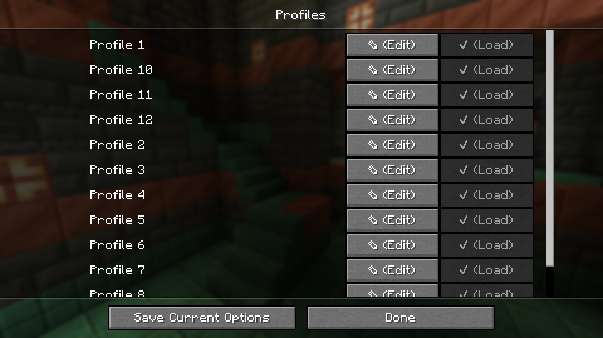

# Options Profiles

Options Profiles is a Minecraft mod that lets you load and save your options as profiles from in-game.

## Features
- Save and load profiles in-game
- Load specific options (like only load keybinds, resource packs or FOV and GUI scale)
- Edit profiles in-game (deleting, renaming, overwriting, pick options  to only load)
- Fabric, NeoForge, Forge support
- Third party mod support (see below)

## Mod Support
Options Profiles supports these mods which means you can create and load profiles with them and the mod will load their configuration.

- Sodium
- Sodium Extra
- Iris
- Distant Horizons
- OptiFine

If you would like support for another mod, open an issue.

## Frequently Asked Questions
- Can you port [version]?
    > Open an issue in the GitHub repository.
- Can I use this in my modpack?
    > You may use this mod in modpacks with credit.
- Where are the profiles saved?
    > Profiles are saved in a folder called "options-profiles" in the specified ".minecraft" directory.
- Where can I find the source code for older versions?
    > You can find them in the branches.
- Dependencies?
    > Versions 1.1 require Architectury API, however versions 1.2+ do not.
- For any other questions, create an issue or contact me at hello@trafficlunar.net

## Gallery

Profiles Menu              | Edit Profile Screen       
:-------------------------:|:-------------------------:
 | 

Options Toggle Menu        | Options Screen     
:-------------------------:|:-------------------------:
 | 
