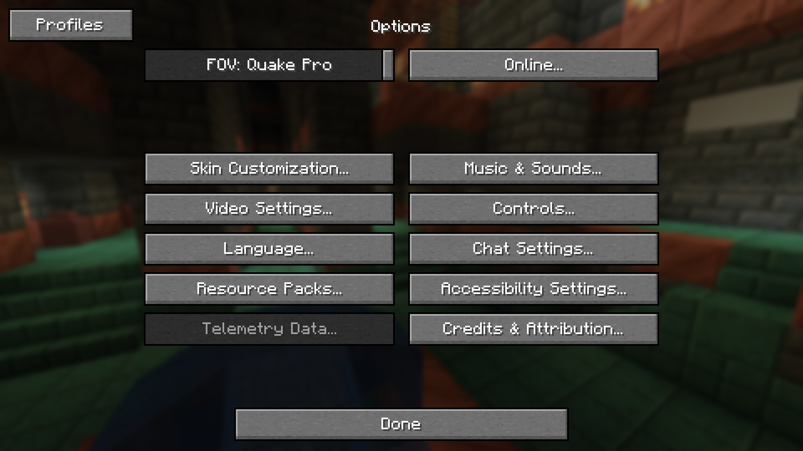

# Options Profiles

Options Profiles lets you load and save your options as profiles from in-game.

## Frequently Asked Questions
- If you would like a version ported, open an issue.
- Versions 1.1 require Architectury API, however versions 1.2+ does not.
- You may use this mod in modpacks / clients with credit.
- You can find other versions in the branches. 

Contact: hello@axolotlmaid.com

## Features
- Profiles are saved in a folder called "options-profiles" in the specified ".minecraft" directory.
- Sodium and Optifine support
- Forge and Fabric support
- Resource packs support
- Save current options
- Edit profiles in-game (deleting, renaming, overwriting)

## Gallery

Profiles Menu              | Edit Profile Screen       | Options Screen
:-------------------------:|:-------------------------:|:-------------------------:
 |  | 
